# F450 Autopilot Simulation

Implementation of an autopilot system in Simulink through motor dynamics, aerodynamics, and 6-DOF kinematics modeling based on the specifications of the educational F450 drone and its propellers.

DJI F450 쿼드콥터의 동특성을 **모터 동역학 → 공기역학(추력·모멘트) → 6자유도 강체 운동학** 순서로 Simulink에 직접 모델링했습니다. 그 위에 **위치·고도·자세 캐스케이드 제어기와 Stateflow 웨이포인트 미션**을 얹어 자율 비행 시뮬레이션까지 완성한 프로젝트입니다.

> 유도제어시스템설계 (2025년 2학기) · MATLAB/Simulink R2024b · 상세 보고서: [`docs/F450_Dynamic_Model_Report.pdf`](docs/F450_Dynamic_Model_Report.pdf)

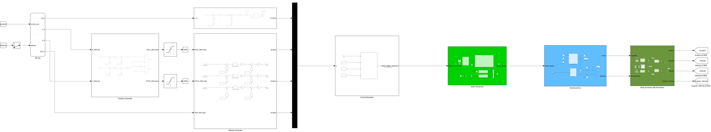

---

## 목차

1. [전체 구조](#전체-구조)
2. [단계별 모델링](#단계별-모델링)
   - [1주차 · GNC 시스템 정의](#1주차--gnc-시스템-정의)
   - [2주차 · Motor Dynamics](#2주차--motor-dynamics)
   - [3주차 · 공력 확장과 호버링](#3주차--공력-확장과-호버링)
   - [4주차 · 기동 원리와 최대 체공시간](#4주차--기동-원리와-최대-체공시간)
   - [5주차 · 좌표 변환과 중력](#5주차--좌표-변환과-중력)
   - [7주차 · 6-DOF 강체 운동방정식](#7주차--6-dof-강체-운동방정식)
   - [텀 프로젝트 · 자동비행 제어기와 웨이포인트 미션](#텀-프로젝트--자동비행-제어기와-웨이포인트-미션)
3. [모델 파일](#모델-파일)
4. [실행 방법](#실행-방법)

---

## 전체 구조

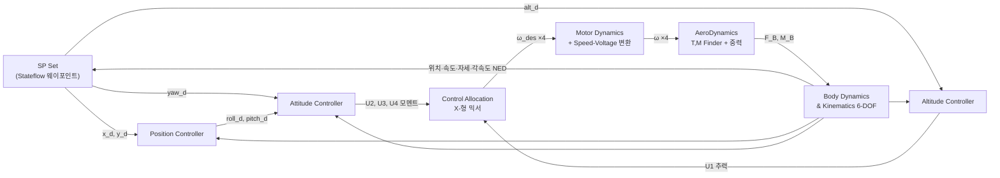
```mermaid
flowchart LR
    SP["SP Set<br/>(Stateflow 웨이포인트)"] -->|x_d, y_d| POS[Position Controller]
    SP -->|alt_d| ALT[Altitude Controller]
    SP -->|yaw_d| ATT[Attitude Controller]
    POS -->|roll_d, pitch_d| ATT
    ALT -->|U1 추력| CA[Control Allocation<br/>X-형 믹서]
    ATT -->|U2, U3, U4 모멘트| CA
    CA -->|ω_des ×4| MD[Motor Dynamics<br/>+ Speed-Voltage 변환]
    MD -->|ω ×4| AERO[AeroDynamics<br/>T,M Finder + 중력]
    AERO -->|F_B, M_B| BODY[Body Dynamics<br/>& Kinematics 6-DOF]
    BODY -->|위치·속도·자세·각속도 NED| SP
    BODY --> POS
    BODY --> ALT
    BODY --> ATT
```

| 파라미터 | 값 | 파라미터 | 값 |
|---|---|---|---|
| 기체 질량 $m$ | 1.5 kg | 암 길이 $L$ | 0.225 m |
| 관성 $I$ | diag(0.02, 0.02, 0.025) kg·m² | 모터 Kv | 960 rpm/V |
| 모터 관성 $J_M$ | 2.8×10⁻⁵ kg·m² | 권선 저항 $R$ | 0.117 Ω |
| 추력계수 $b$ | 1.1768×10⁻⁵ N·s² | 반토크계수 $d$ | 1.8542×10⁻⁷ N·m·s² |

---

## 단계별 모델링

### 1주차 · GNC 시스템 정의

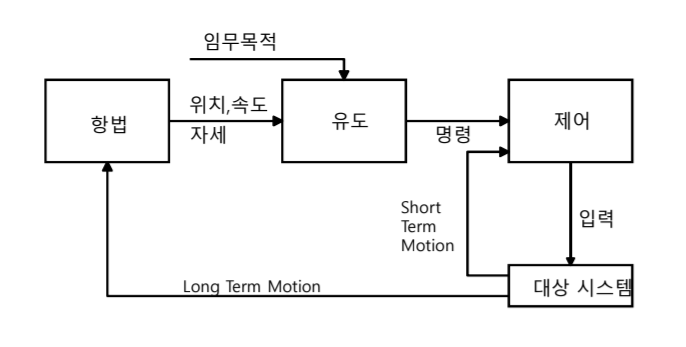

- **동작 흐름**: 임무 목적(설정값)과 센서로 측정한 현재 위치·자세·속도의 오차를 계산합니다. 유도(Guidance)가 오차를 줄일 명령을 만들고, 제어(Control)가 대상 시스템에 입력을 넣습니다. 이 과정을 반복해 설정값에 수렴시킵니다.
- **Dynamic modeling의 목적**:
  - **System analysis**: 비행 안정성, 조종성, 전력 소모를 분석합니다.
  - **Control law design & simulation**: 실패 위험이 있는 시험을 가상으로 수행해 비용과 시간을 줄입니다.

<br clear="right">

### 2주차 · Motor Dynamics

모터 토크는 회전축 토크와 베어링 마찰에 의한 역토크의 합으로 정의하고, 전기자 인덕턴스는 기계적 시간상수보다 매우 빠르므로 무시했습니다(키르히호프 전압 법칙).

```math
J_M\dot{\omega} = K_T\,i - b_f\,\omega,\qquad i = \frac{V - K_e\,\omega}{R}
\;\;\Rightarrow\;\;
\dot{\omega} = \frac{1}{J_M}\left(\frac{K_T\,(V - K_e\,\omega)}{R} - b_f\,\omega\right)
```

- 무손실 가정(전기 입력 = 기계 출력)에서 $K_e = K_T$입니다.
- 토크상수는 속도상수의 역수이므로 $K_T = \dfrac{60}{2\pi \cdot 960} = 0.00995\ \mathrm{N\,m/A}$입니다.
- 라플라스 변환하면 **1차 시스템**이 됩니다.

```math
\frac{\Omega(s)}{V(s)} = \frac{k_s}{\tau s + 1},\qquad
\tau = \frac{J_M R}{R\,b_f + K_T K_e} = 0.0296\ \mathrm{s},\qquad
k_s = \frac{K_T}{R\,b_f + K_T K_e} = 89.9\ \mathrm{\frac{rad/s}{V}}
```

<p>
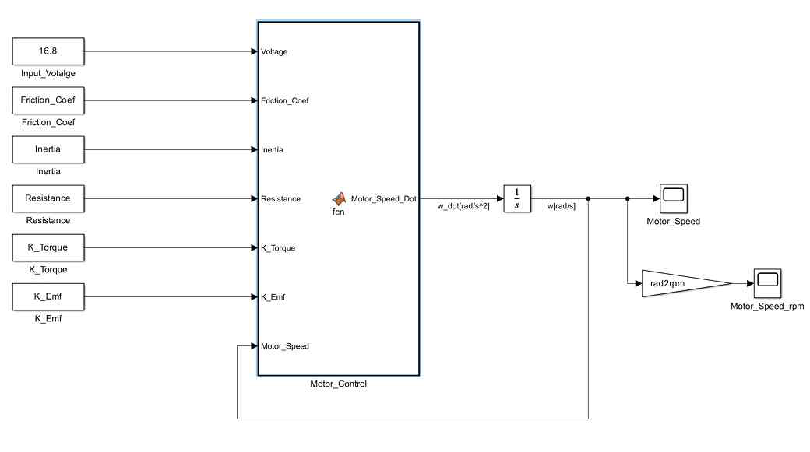
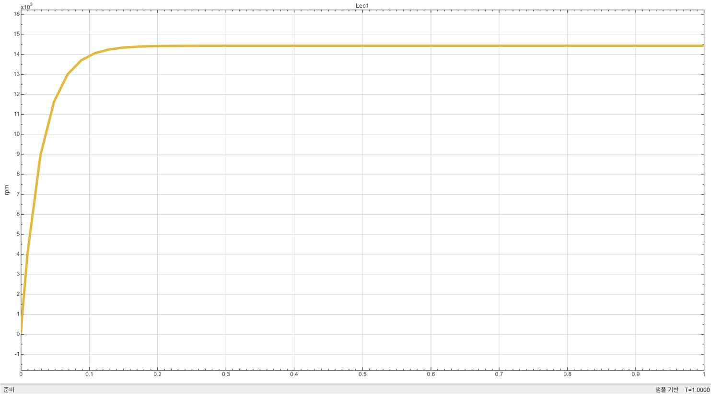
</p>

- **결과 (입력 16.8 V)**:
  - 정상상태 회전수는 **1510 rad/s(≈ 14,420 rpm)**입니다.
  - 마찰과 저항을 모두 무시한 이상값 $K_v \cdot V = 16{,}128$ rpm보다 낮게 나와, 손실을 반영한 결과임을 확인했습니다.

### 3주차 · 공력 확장과 호버링

모터 자체 마찰보다 **프로펠러 항력이 만드는 반토크**가 훨씬 크므로, 마찰항을 공력 항력항 $d\,\omega^2$로 바꿨습니다.

```math
T_i = b\,\omega_i^2,\qquad Q_i = d\,\omega_i^2,\qquad
J_M\dot{\omega} = K_T\,i - d\,\omega^2
```

**호버링 회전수**는 네 모터 추력의 합이 중력과 평형을 이룬다는 조건에서 구했습니다.

```math
4\,b\,\omega_h^2 = m g \;\Rightarrow\; \omega_h = \sqrt{\frac{m g}{4 b}} = 559.11\ \mathrm{rad/s}
```

**Speed-Voltage Conversion**은 목표 회전수를 입력 전압으로 바꾸는 블록입니다. $\dot\omega = 0$ 조건에서 아래 식을 얻습니다.

```math
V = K_e\,\omega_d + \frac{R}{K_T}\,d\,\omega^2
```

- 기전력 항에는 목표 회전수 $\omega_d$를, 항력 손실 항에는 현재 회전수 $\omega$를 넣어 루프로 계속 보정합니다.
- 결과: 입력 전압은 5.56 V(t = 0)에서 **6.24 V**로 수렴하고, 모터 회전수는 559.1 rad/s를 유지합니다.

<p>
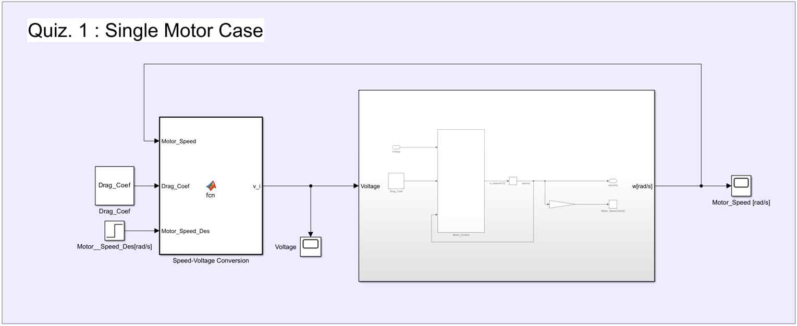
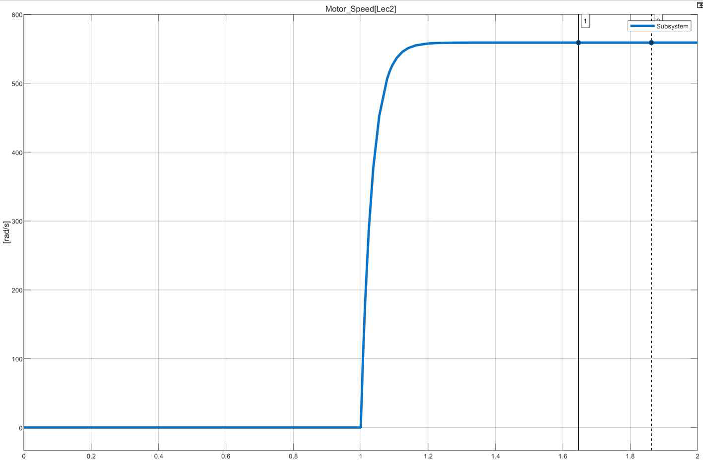
</p>

**T,M Finder**는 네 모터 회전수를 열벡터로 받아 동체좌표계(NED)의 힘과 모멘트를 계산합니다. X형 배치 기준 식은 아래와 같습니다.

```math
\mathbf{F}^B = \begin{bmatrix} 0 \\ 0 \\ -b\sum_{i}\omega_i^2 \end{bmatrix},\qquad
\mathbf{M}^B = \begin{bmatrix}
\frac{L b}{\sqrt{2}}\,(\omega_2^2 + \omega_3^2 - \omega_1^2 - \omega_4^2) \\
\frac{L b}{\sqrt{2}}\,(\omega_1^2 + \omega_3^2 - \omega_2^2 - \omega_4^2) \\
d\,(\omega_1^2 + \omega_2^2 - \omega_3^2 - \omega_4^2)
\end{bmatrix}
```

<p>
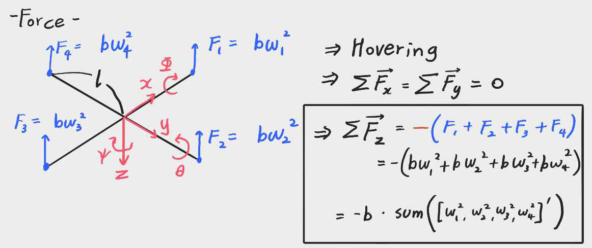
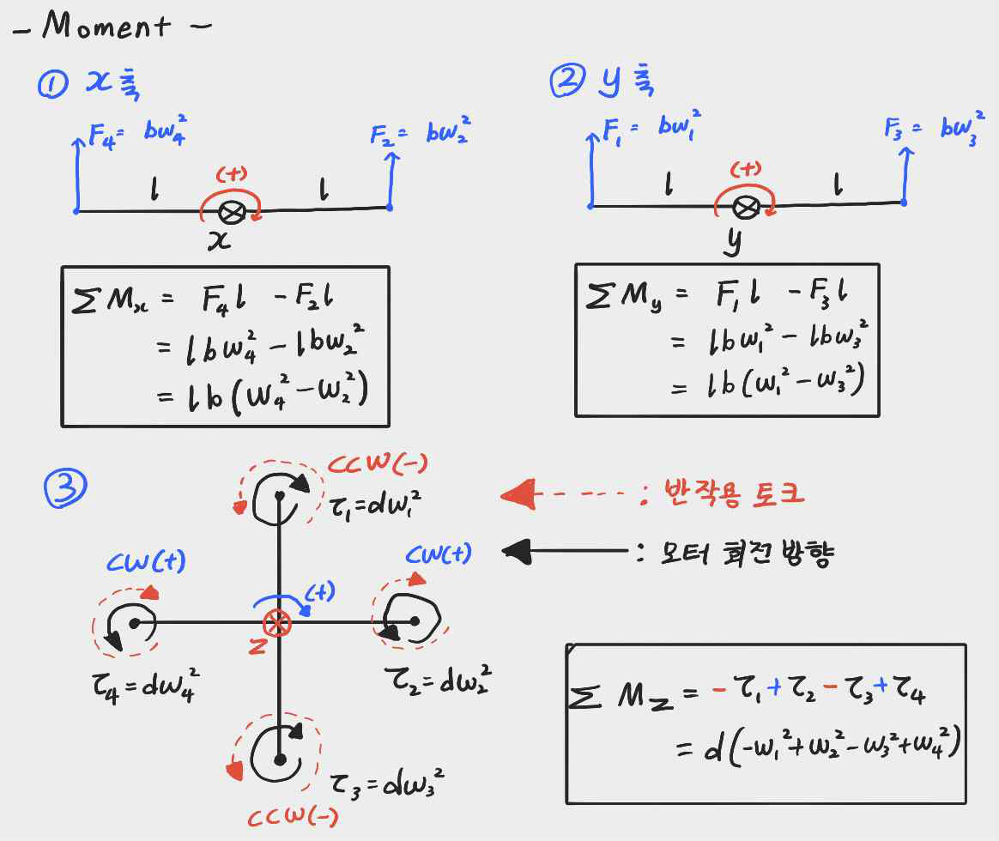
</p>

- 호버링 결과: $F_z = -14.7$ N(NED 기준 위쪽)이고, $F_x = F_y = 0$, 모멘트는 3축 모두 0입니다. 이론값과 일치합니다.

<p>
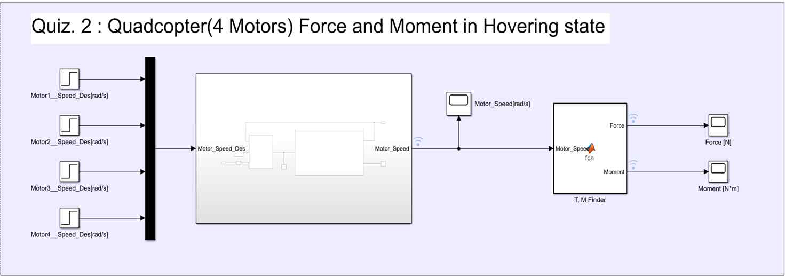
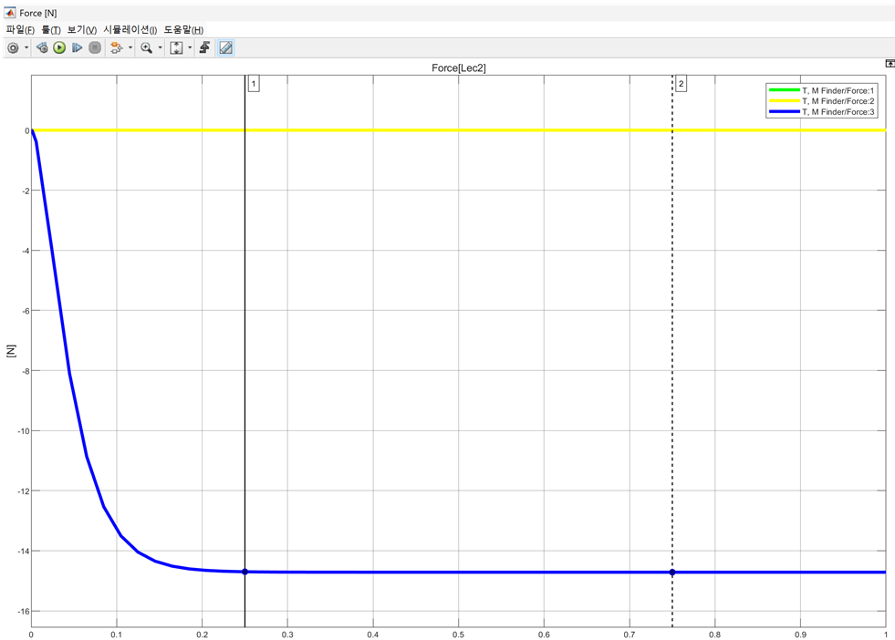
</p>

### 4주차 · 기동 원리와 최대 체공시간

- **기동 원리**:
  - **Yaw**: 1·3번 모터를 2·4번보다 빠르게 돌리면 반토크 차이로 회전합니다.
  - **전진·후진**: 마주 보는 모터의 추력 차이로 기체를 기울여 이동합니다.
  - **상승·하강**: 네 모터의 전압을 함께 올리거나 내립니다.
- **최대 체공시간**은 운동량 이론(Actuator disk)으로 계산했습니다.

```math
T = 2\rho A v_i^2,\qquad
P_\text{ideal} = T\,v_i = \frac{T^{3/2}}{\sqrt{2\rho A}},\qquad
P = \frac{4\,P_\text{ideal}}{FM},\qquad
t_\text{flight} = \frac{E_\text{batt}}{P}
```

| 스크립트 | 질량 | FM | 배터리 | 기체 소요동력 | 최대 호버링 시간 |
|---|---|---|---|---|---|
| [`4th_flight_time_cal.m`](scripts/flight_time/4th_flight_time_cal.m) | 1.762 kg | 0.8 | 1500 mAh / 14.8 V | 137.5 W | **9.69 분** (보고서 결과) |
| [`4th_flight_time_calculation.m`](scripts/flight_time/4th_flight_time_calculation.m) | 1.5 kg | 0.4 | 5000 mAh / 14.8 V | 213.4 W | 20.81 분 |

프로펠러 반경은 두 경우 모두 0.119 m입니다.

### 5주차 · 좌표 변환과 중력

- 동체좌표계(NED, Body-fixed)에서 계산한 운동을 조종자가 볼 수 있도록 지구고정좌표계(Earth-fixed)로 바꿉니다.
- 지구는 드론 운동에 비해 충분히 느리게 움직이므로 관성계로 가정했습니다.

```math
R_B^E = R_z(\psi)\,R_y(\theta)\,R_x(\phi) =
\begin{bmatrix}
c\psi c\theta & c\psi s\theta s\phi - s\psi c\phi & c\psi s\theta c\phi + s\psi s\phi \\
s\psi c\theta & s\psi s\theta s\phi + c\psi c\phi & s\psi s\theta c\phi - c\psi s\phi \\
-s\theta & c\theta s\phi & c\theta c\phi
\end{bmatrix},\qquad
R_E^B = \left(R_B^E\right)^T
```

- 회전행렬은 직교행렬이라 역행렬 대신 전치행렬을 씁니다.
- 오일러각은 $-\pi/2 < \theta < \pi/2$ 범위에서만 유효합니다(**짐벌락** 조건).
- 중력은 지구좌표계 $[0,\,0,\,g]^T$를 동체좌표계로 옮겨 모터 힘과 합칩니다.

```math
\mathbf{F}_g^B = R_E^B \begin{bmatrix}0\\0\\mg\end{bmatrix}
= m g \begin{bmatrix} -\sin\theta \\ \sin\phi\cos\theta \\ \cos\phi\cos\theta \end{bmatrix}
```

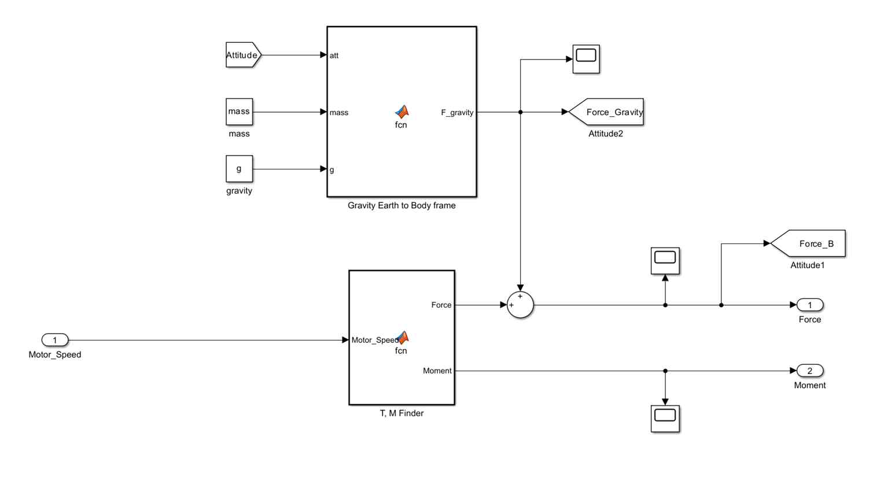

### 7주차 · 6-DOF 강체 운동방정식

**Transport theorem**(회전좌표계에서 본 운동을 관성계로 기술)을 적용해 위치, 속도, 자세, 각속도를 구했습니다.

```math
\begin{aligned}
\dot{\mathbf{p}}^E &= R_B^E\,\mathbf{v}^B \\
\dot{\mathbf{v}}^B &= \frac{1}{m}\,\mathbf{F}^B - \boldsymbol{\omega}\times\mathbf{v}^B \\
\dot{\boldsymbol{\Theta}} &=
\begin{bmatrix}
1 & \sin\phi\tan\theta & \cos\phi\tan\theta \\
0 & \cos\phi & -\sin\phi \\
0 & \sin\phi\sec\theta & \cos\phi\sec\theta
\end{bmatrix}\boldsymbol{\omega} \\
\dot{\boldsymbol{\omega}} &= I^{-1}\left(\mathbf{M}^B - \boldsymbol{\omega}\times I\,\boldsymbol{\omega}\right)
\end{aligned}
```

- 병진 식의 두 번째 항 $\boldsymbol{\omega}\times\mathbf{v}$는 관성 교차항(코리올리 성분)입니다.
- 회전 식의 $\boldsymbol{\omega}\times I\boldsymbol{\omega}$는 관성모멘트 불균형에 의한 자이로 커플링입니다.

<p>
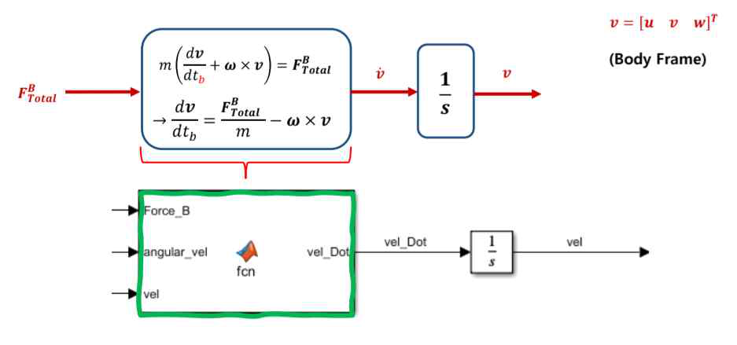
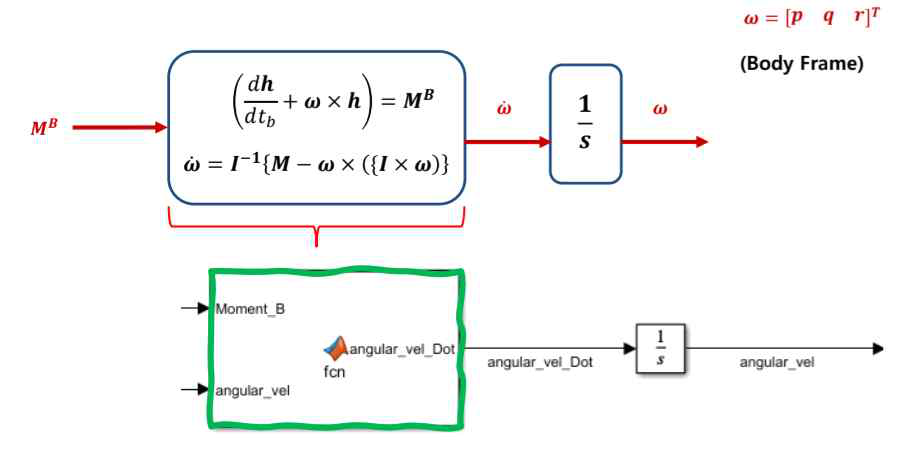
</p>

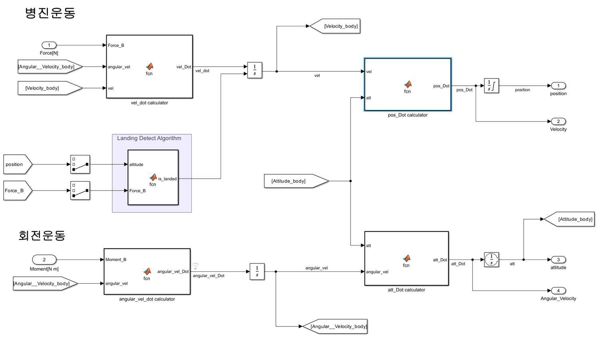

**Landing Detection**은 지면을 뚫고 내려가는 위치 해를 막는 장치입니다. 고도 $z \ge 0$이면서 동체 $F_z > 0$(아래 방향 합력)이면 착지로 판정하고, 속도 적분기를 리셋해 위치 갱신을 멈춥니다.

```matlab
is_landed = (altitude >= 0) && (Force_B > 0);   % 교안의 조건문 두 개를 한 줄로
```

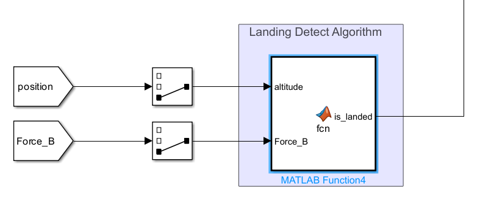

**통합 모델 검증**

| 입력 | 결과 |
|---|---|
| 네 모터 모두 호버링 회전수 559.11 rad/s | 위치와 자세 변화 없음 → 정상 |
| 모터1 +20 rad/s, 모터3 −20 rad/s | 예상(−x 방향 후진)과 달리 3사분면으로 이동. t ≈ 1.7 s에서 자세·각속도가 **발산** |

- 발산 원인은 지속적인 회전으로 $\theta \to \pm 90^\circ$에 도달하면서 생긴 **짐벌락**(오일러각 변환행렬의 $\sec\theta$ 발산)입니다.
- 쿼터니언 방식으로 해결할 수 있다는 결론을 냈습니다.

<p>
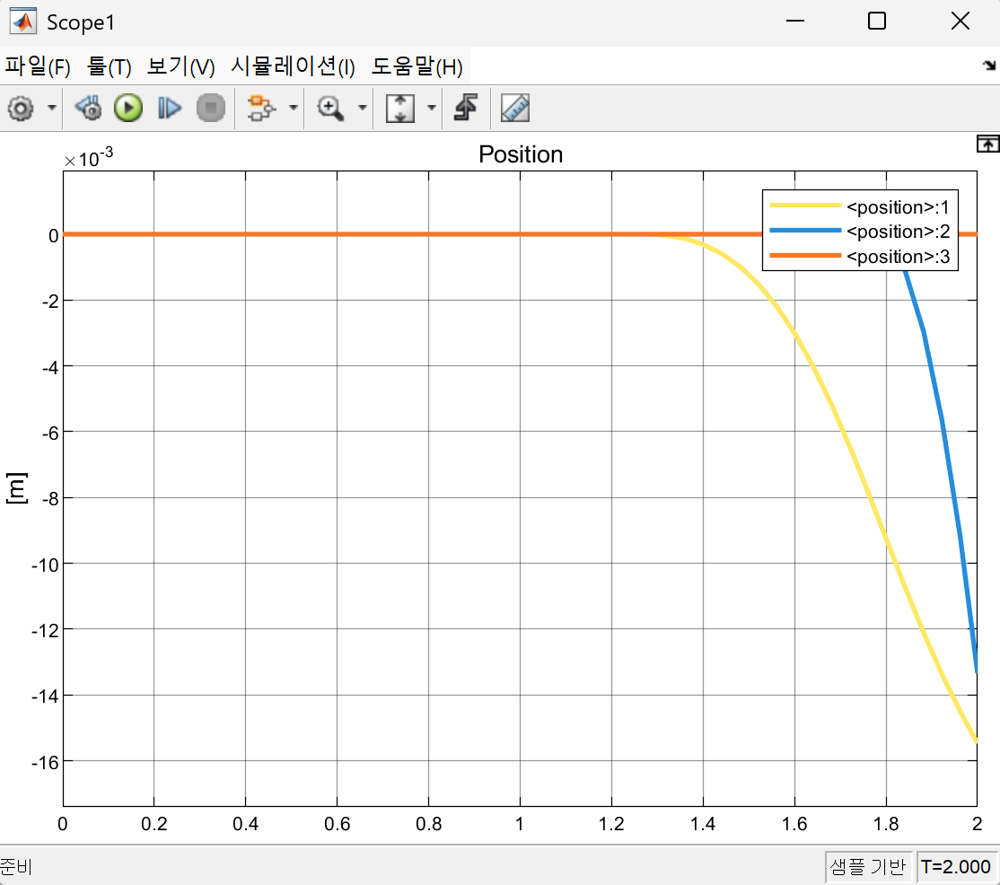
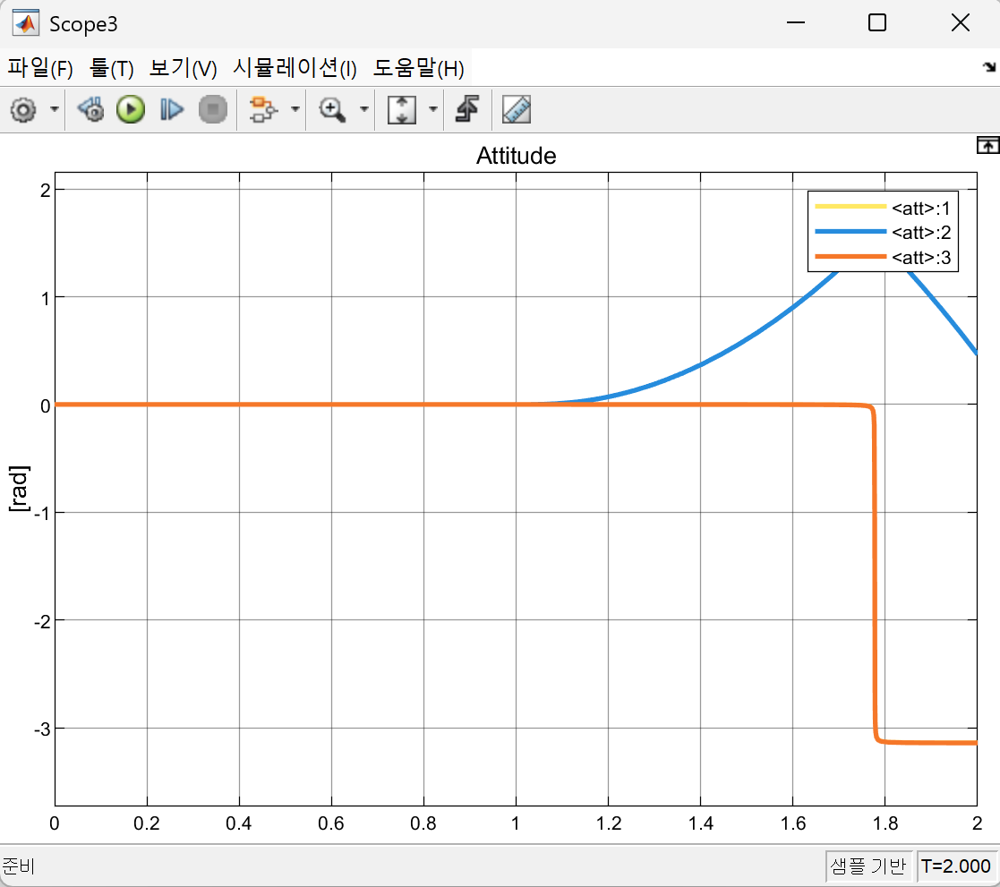
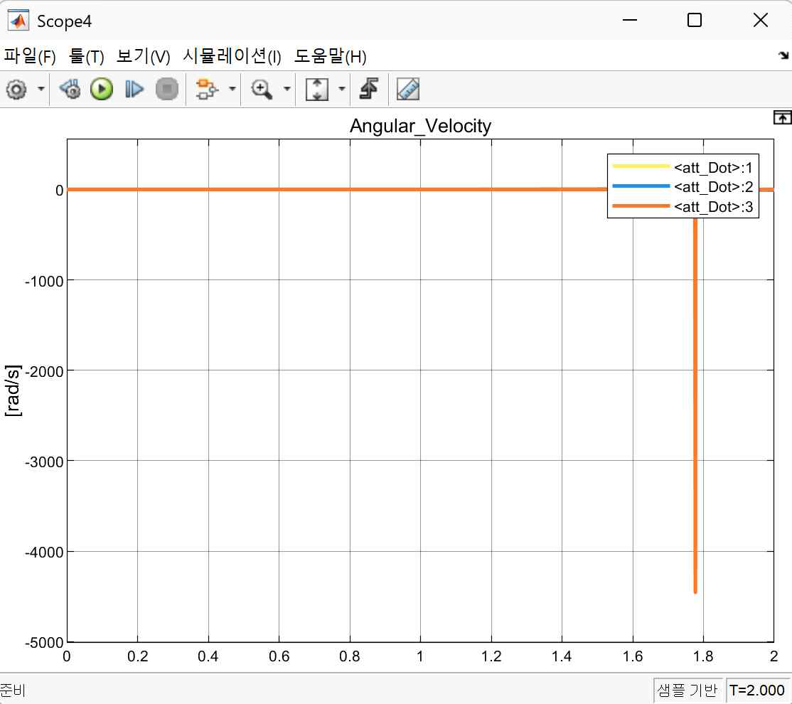
</p>

### 텀 프로젝트 · 자동비행 제어기와 웨이포인트 미션

7주차까지 만든 개루프 플랜트에 제어기를 더해 폐루프 자동비행을 구현했습니다.

| 블록 | 구성 |
|---|---|
| **Position Controller** | 위치 오차 → 목표 속도(K2 = 0.1) → 속도 오차 → 목표 가속도(K1 = 8). yaw로 좌표를 돌린 뒤 $\phi_d = T_y'/U_1$, $\theta_d = -T_x'/U_1$, 목표 기울기는 ±30°로 제한 |
| **Altitude Controller** | 고도 오차 → 목표 상승률(K2 = 0.7142, **−1.5 ~ 3 m/s 포화**) → 상승률 오차(K1 = 2.1) + 중량 $mg$ 피드포워드, 기울기 보상 $U_1 = T_z/(\cos\phi\cos\theta)$ |
| **Attitude Controller** | 각도 P → 각속도 P 캐스케이드. roll·pitch는 5 / 0.196, yaw는 0.9286 / 0.0455. ±π **최단 회전(Shortest Turn)** 보정 |
| **Control Allocation** | $[U_1\;U_2\;U_3\;U_4]^T = A\,[\omega_1^2 \dots \omega_4^2]^T$의 역행렬(X형), 음수는 0으로 제한한 뒤 제곱근 |
| **SP Set (Stateflow)** | 이륙 → **80 m 상승** → 헤딩 정렬 → WP1(−554.4, −73.5) → WP2(−2864.4, −294) → 원점 복귀 → **50 m 하강** → 착륙. 위치 오차 1 m, yaw 오차 0.01 rad 이내에서 다음 상태로 전이 |

<details>
<summary>제어기 세부 다이어그램</summary>

**Position Controller**
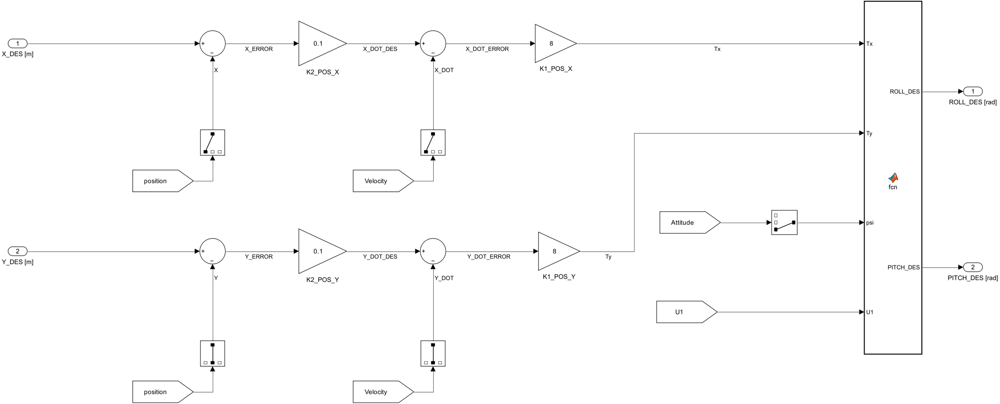

**Altitude Controller**
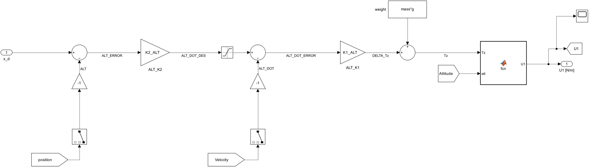

**Attitude Controller**
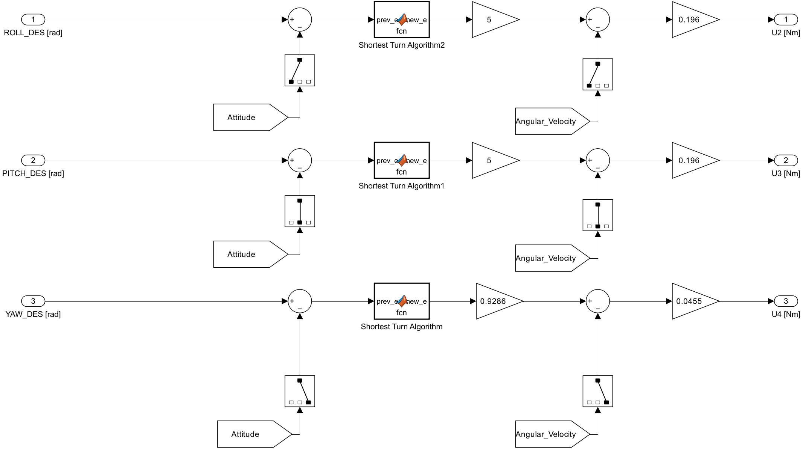

**Body Dynamics & Kinematics**
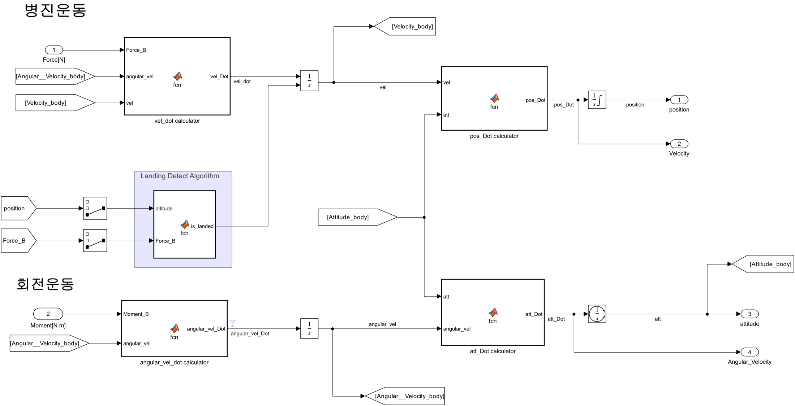

</details>

---

## 모델 파일

| 폴더 | 모델 | 내용 |
|---|---|---|
| [`models/01_motor_dynamics`](models/01_motor_dynamics) | `Motor_Dynamics_practice1_2025a.slx` | 2주차: 단일 모터 전압 → 회전수 (1차 시스템) |
| [`models/02_aerodynamics_hover`](models/02_aerodynamics_hover) | `Motor_Dynamics_practice1_2024b.slx`<br>`Motor_Dynamics_practice2_final_2024b.slx` | 3주차: Speed-Voltage Conversion(Quiz 1), 4개 모터 T,M Finder(Quiz 2) |
| [`models/03_6dof_body_kinematics`](models/03_6dof_body_kinematics) | `kinematics_practice5_2024b.slx` | 5~7주차: 모터 + 공력 + 중력 + 6-DOF 통합 (개루프) |
| [`models/04_pd_control_basics`](models/04_pd_control_basics) | `udo10th.slx` | 10주차: 피치각 30° 스텝 추종 P / PD 제어 |
| [`models/05_autopilot`](models/05_autopilot) | `autopilot_controller_tuning.slx` | 텀 프로젝트: 제어기 튜닝용 (스텝 목표값) |
| | **`autopilot_waypoint_mission.slx`** | **텀 프로젝트 최종**: Stateflow 웨이포인트 미션 + UAV Animation |

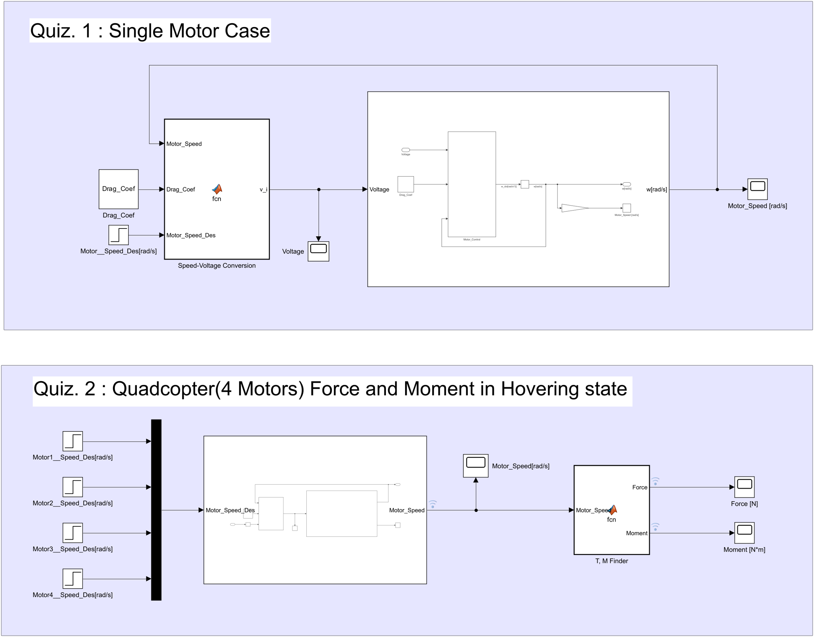

```
F450-Autopilot-simulation/
├── models/                 # 단계별 Simulink 모델 (위 표 참고)
├── scripts/flight_time/    # 운동량 이론 기반 최대 체공시간 계산
└── docs/
    ├── F450_Dynamic_Model_Report.pdf   # 1~7주차 동특성 모델링 보고서
    └── images/
```

## 실행 방법

1. MATLAB **R2024b 이상**에서 원하는 `.slx`를 엽니다. 파라미터는 모델 콜백(`Model Properties → Callbacks → InitFcn`)에 들어 있어 별도 스크립트가 필요 없습니다.
2. **Run**을 누르고 Scope에서 위치, 속도, 자세, 각속도를 확인합니다.
3. 최종 모델의 3D 애니메이션 블록은 **UAV Toolbox**가 필요합니다. 설치되어 있지 않으면 해당 블록만 주석 처리(Comment Out)하고 실행하세요.
4. `Motor_Dynamics_practice1_2024b.slx`는 R2025b에서 저장된 파일이라 R2025b 이상에서 열립니다.

## 참고

- 유도제어시스템설계 강의 교안 (1–7주차)
- 관련 프로젝트: [F450-Vision-based-Precision-Landing](https://github.com/sjuaero/F450-Vision-based-Precision-Landing)
